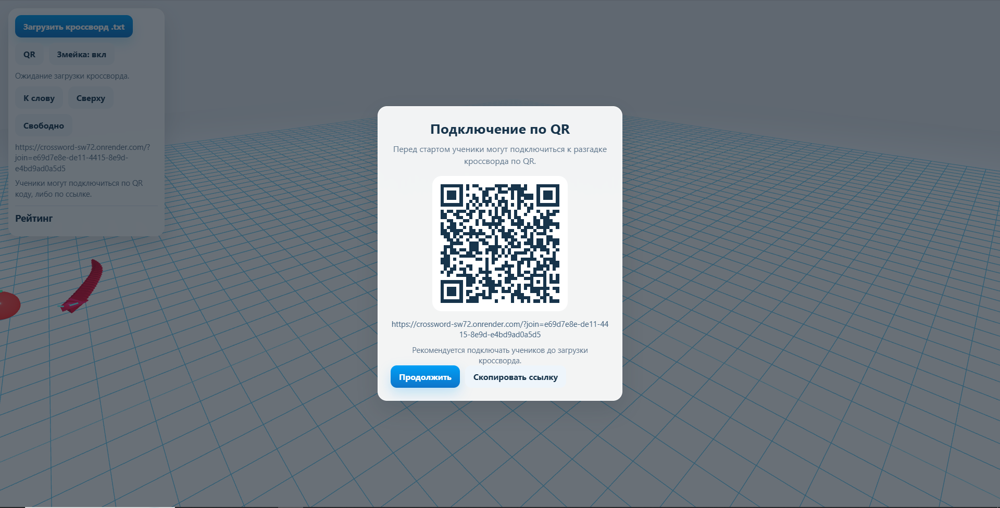
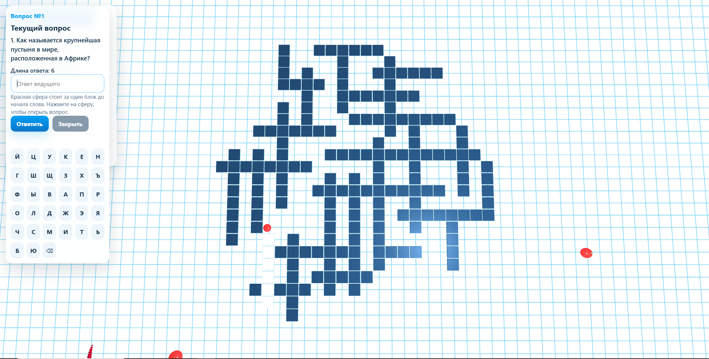
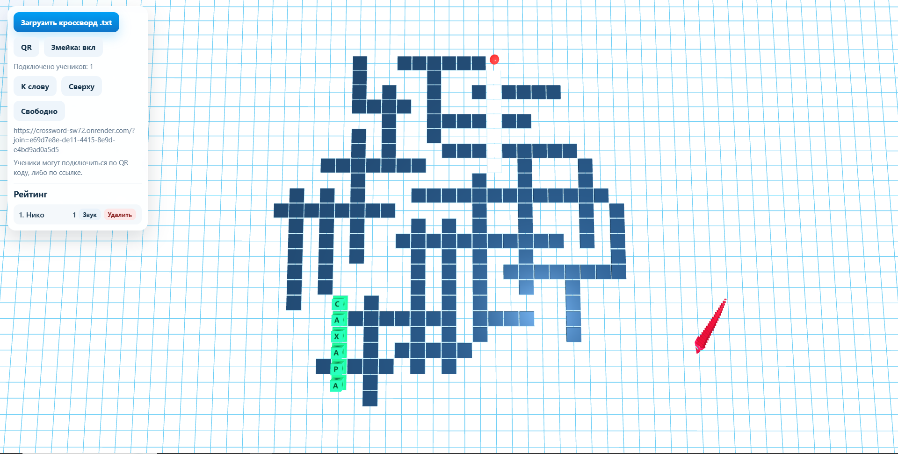
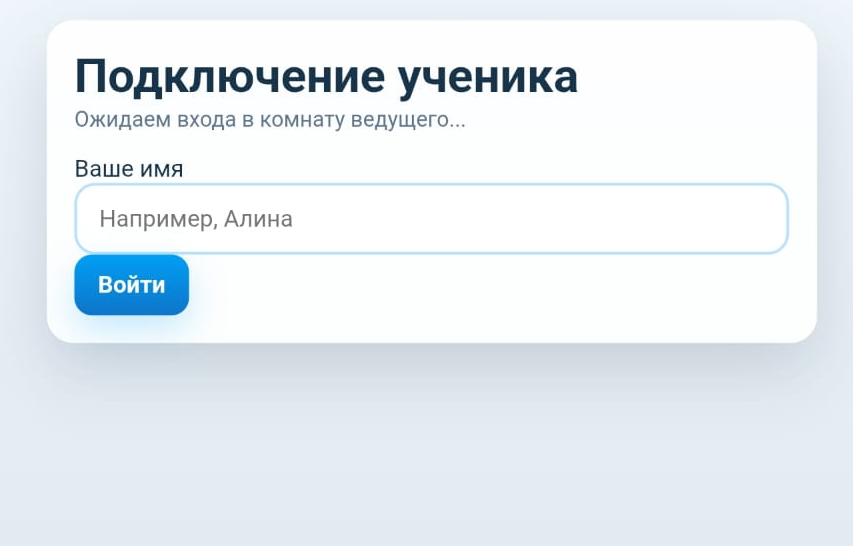
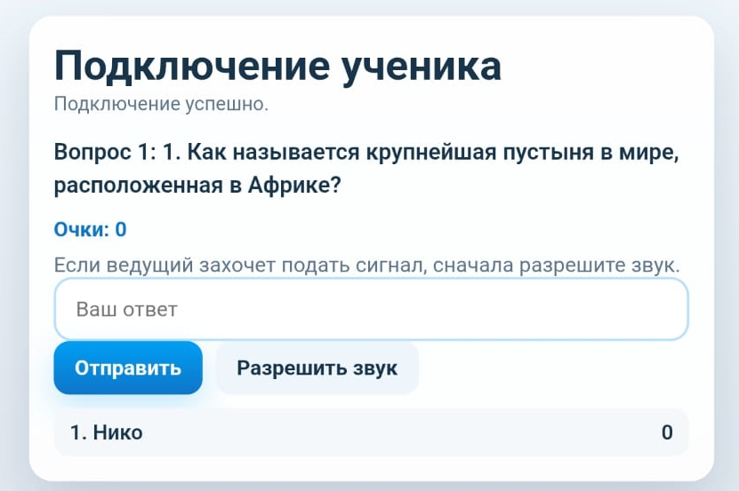

# Crossword Multiplayer Game

## 📌 О проекте

Crossword Multiplayer Game — это образовательная мультиплеерная веб-игра, где пользователи подключаются к одной сессии через QR-код и совместно решают кроссворд в реальном времени.

Проект объединяет игровое пространство, систему баллов и визуальную интерактивность.

---

## 🌐 Вход в систему (QR-подключение)

Игроки подключаются к общей игровой сессии через QR-код.  
После входа все участники оказываются в одном пространстве.

---

## 🎮 Игровое поле (кроссворд)

Игровое пространство с кроссвордом (На изображении всего 30 слов, но это не предел).  
Все игроки получают одинаковые вопросы одновременно, вопросы у всех меняются каждый раз, когда один из участников ответит верно.

---

## ✍️ Ответ игрока (визуализация)

После ответа появляется визуализация:
- буквы отображаются как 3D-кубы
- правильные ответы подсвечиваются зелёным цветом

---

## 📱 Подключение с телефона

Экран входа с мобильного устройства:
- ввод имени игрока
- подключение к общей сессии

---

## 🏆 Интерфейс игры и очки

Игровой экран:
- вопрос
- поле ввода ответа
- список игроков
- система баллов за скорость и правильность ответов

---

## 💡 Идея проекта

Проект создан как интерактивная образовательная система, где:
- все игроки работают в одном пространстве
- ответы сравниваются по скорости
- формируется соревновательная среда обучения

---

## 🧠 Формат кроссворда (.txt)

Вопросы и ответы для кроссворда создаются в простом текстовом файле (`.txt`), который можно редактировать в любом текстовом редакторе.

При загрузке файла система автоматически преобразует его в структуру кроссворда.

### 📌 Правила оформления:

- файл должен иметь формат `.txt`
- вопросы и ответы записываются последовательно
- ответ всегда пишется **ЗАГЛАВНЫМИ БУКВАМИ**
- каждый вопрос сопровождается своим ответом

### 🧾 Пример:

1. Вопрос?\nОТВЕТ
2. Вопрос?\nОТВЕТ
3. Вопрос?\nОТВЕТ

## ⚙️ Технологии

### Frontend
- HTML
- CSS
- JavaScript

### Backend
- Node.js
- Express — сервер и обработка подключений
- Socket.IO — синхронизация игроков в реальном времени

### Архитектура
- Клиент-серверная модель
- Общая игровая сессия для всех участников
- Реальное время (real-time updates)
